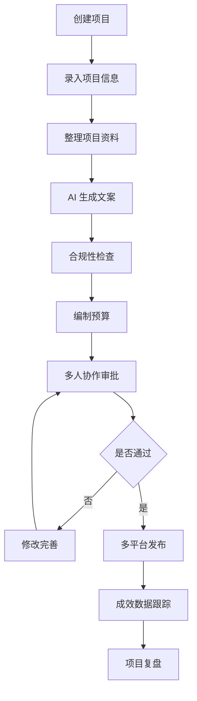

## 1. 产品概述

公益募捐材料 AI 撰写平台，帮助公益组织高效、专业地完成募捐项目材料的全流程制作。平台通过 AI 辅助文案生成、合规审查、预算规划等功能，降低公益组织的运营成本，提升募捐材料的专业性和说服力。

- 核心价值：让每一份善意都被专业呈现，助力公益组织获得更多社会支持
- 目标用户：公益组织项目官员、传播专员、筹款负责人
- 解决问题：募捐材料撰写耗时、专业度不足、合规风险高、多平台适配困难

## 2. 核心功能

### 2.1 用户角色

| 角色 | 注册方式 | 核心权限 |
|------|----------|----------|
| 项目负责人 | 邮箱/手机号注册 | 创建项目、管理成员、审批发布 |
| 文案专员 | 邀请加入 | 撰写文案、上传资料、编辑内容 |
| 财务专员 | 邀请加入 | 编制预算、票据管理、数据核对 |

### 2.2 功能模块

1. **项目页**：项目基础信息录入，目标人群定义，预算规划，周期设置，执行地区管理
2. **资料页**：项目图片库，案例故事，票据凭证，过往成果展示
3. **文案页**：AI 生成项目简介、募捐理由、进展更新、感谢信
4. **合规页**：敏感表述检测，数字缺口提示，证明材料清单
5. **预算页**：费用拆分明细，匹配说明，可视化图表展示
6. **协作页**：多人批注，版本对比，审批流程
7. **发布页**：多平台字数适配，封面生成，二维码制作
8. **成效页**：阅读数据，捐赠统计，转发分析，回访记录，复盘清单

### 2.3 页面详情

| 页面名称 | 模块名称 | 功能描述 |
|----------|----------|----------|
| 项目页 | 基础信息 | 项目名称、简介、目标金额、周期设置 |
| 项目页 | 目标人群 | 人群画像、受益人数、需求分析 |
| 项目页 | 执行地区 | 地区选择、覆盖范围、实施计划 |
| 资料页 | 图片管理 | 图片上传、分类管理、封面选择 |
| 资料页 | 案例故事 | 受益人故事、典型案例、影像资料 |
| 资料页 | 票据凭证 | 财务票据、资质证明、合规文件 |
| 资料页 | 过往成果 | 历史项目、成效数据、社会评价 |
| 文案页 | 项目简介 | AI 生成、模板选择、风格调整 |
| 文案页 | 募捐理由 | 需求分析、社会价值、紧迫性说明 |
| 文案页 | 进展更新 | 阶段报告、进度展示、后续计划 |
| 文案页 | 感谢信 | 捐赠人感谢、成果反馈、情感表达 |
| 合规页 | 敏感词检测 | 表述风险提示、修改建议、合规指引 |
| 合规页 | 数字核验 | 数据缺口提醒、佐证要求、核实建议 |
| 合规页 | 材料清单 | 必备证明、补充材料、提交指引 |
| 预算页 | 费用拆分 | 明细科目、金额分配、占比分析 |
| 预算页 | 匹配说明 | 资金来源、配比比例、使用说明 |
| 预算页 | 可视化图表 | 饼图、柱状图、趋势图展示 |
| 协作页 | 批注功能 | 位置标注、评论回复、@提醒 |
| 协作页 | 版本管理 | 历史版本、差异对比、回滚恢复 |
| 协作页 | 审批流程 | 提交审核、多级审批、发布确认 |
| 发布页 | 平台适配 | 多平台字数限制、格式调整、预览 |
| 发布页 | 封面制作 | 图片编辑、文字叠加、模板选择 |
| 发布页 | 二维码生成 | 链接转换、样式定制、下载导出 |
| 成效页 | 数据概览 | 阅读量、捐赠额、转发数统计 |
| 成效页 | 捐赠分析 | 捐赠人画像、金额分布、时间趋势 |
| 成效页 | 回访记录 | 受益人反馈、项目跟进、成果展示 |
| 成效页 | 复盘清单 | 经验总结、问题分析、改进计划 |

## 3. 核心流程

用户从创建项目开始，依次完成资料整理、文案撰写、合规检查、预算编制，通过协作审批后发布到各平台，最后跟踪成效数据并进行项目复盘。

## 4. 用户界面设计

### 4.1 设计风格

- **主色调**：暖橙色 (#FF8C42) — 代表温暖、希望、活力
- **辅助色**：森林绿 (#2D6A4F) — 代表生命、成长、信任
- **背景色**：米白色 (#FFF9F2) — 温暖柔和，营造公益氛围
- **中性色**：深灰 (#333333) 用于文字，浅灰 (#F5F5F5) 用于卡片背景
- **按钮风格**：圆角胶囊形按钮，带有柔和阴影，悬停时有微动画
- **字体**：标题使用「思源宋体」体现人文温度，正文使用「Inter」保证可读性
- **布局风格**：卡片式布局，温暖柔和的阴影，充足的留白
- **图标风格**：线性图标，与暖橙色主色调一致

### 4.2 页面设计概览

| 页面名称 | 模块名称 | UI 元素 |
|----------|----------|----------|
| 项目页 | 基础信息 | 表单卡片、步骤指示器、暖橙色按钮 |
| 资料页 | 图片管理 | 网格布局、拖拽上传、图片预览模态框 |
| 文案页 | AI 生成 | 输入框、生成按钮、打字机效果输出 |
| 合规页 | 检测结果 | 风险等级标签、问题列表、修改建议 |
| 预算页 | 图表展示 | 环形饼图、柱状图、数据卡片 |
| 协作页 | 批注功能 | 侧边批注面板、高亮标注、评论气泡 |
| 发布页 | 平台适配 | 平台选项卡、字数计数器、预览视图 |
| 成效页 | 数据概览 | 数据仪表盘、趋势折线图、统计卡片 |

### 4.3 响应式

- 桌面优先设计，适配 1440px、1024px 主流分辨率
- 平板端：侧边栏收起为图标导航，内容区域自适应
- 移动端：底部 Tab 导航，卡片纵向堆叠，表单简化
- 触控优化：按钮最小 44px 触控区域，手势滑动支持

### 4.4 动效设计

- 页面切换：淡入淡出 + 轻微位移动画，时长 300ms
- 卡片悬停：上浮 4px + 阴影加深，时长 200ms
- 按钮交互：缩放 0.97 + 颜色加深，时长 150ms
- 数据加载：骨架屏脉冲动画，内容渐入显示
- AI 生成打字效果：文字逐字显现，光标闪烁
