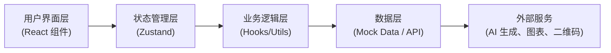

## 1. 架构设计



## 2. 技术说明

- **前端框架**：React 18 + TypeScript
- **构建工具**：Vite 5
- **样式方案**：Tailwind CSS 3
- **状态管理**：Zustand
- **路由管理**：React Router DOM 6
- **图表库**：Recharts（React 图表组件库）
- **图标库**：Lucide React
- **UI 组件**：自定义组件（基于 Tailwind）
- **二维码生成**：qrcode.react
- **富文本编辑**：自定义轻量编辑器

## 3. 路由定义

| 路由 | 页面 | 说明 |
|------|------|------|
| / | 项目列表页 | 项目总览，创建新项目入口 |
| /project/:id | 项目信息页 | 项目基础信息、目标人群、执行地区 |
| /project/:id/materials | 资料页 | 图片、案例、票据、成果管理 |
| /project/:id/copywriting | 文案页 | AI 文案生成与编辑 |
| /project/:id/compliance | 合规页 | 敏感词检测、数字核验、材料清单 |
| /project/:id/budget | 预算页 | 费用拆分、匹配说明、可视化图表 |
| /project/:id/collaboration | 协作页 | 批注、版本对比、审批流程 |
| /project/:id/publish | 发布页 | 平台适配、封面、二维码 |
| /project/:id/results | 成效页 | 数据跟踪、复盘清单 |

## 4. 数据模型

### 4.1 项目 (Project)

| 字段 | 类型 | 说明 |
|------|------|------|
| id | string | 项目唯一标识 |
| name | string | 项目名称 |
| description | string | 项目简介 |
| targetAmount | number | 目标金额（元） |
| raisedAmount | number | 已筹金额（元） |
| startDate | string | 开始日期 |
| endDate | string | 结束日期 |
| status | 'draft' \| 'reviewing' \| 'approved' \| 'published' | 项目状态 |
| targetGroup | TargetGroup | 目标人群 |
| regions | Region[] | 执行地区 |
| createdAt | string | 创建时间 |
| updatedAt | string | 更新时间 |

### 4.2 目标人群 (TargetGroup)

| 字段 | 类型 | 说明 |
|------|------|------|
| description | string | 人群描述 |
| beneficiaryCount | number | 受益人数 |
| needsAnalysis | string | 需求分析 |
| demographics | string | 人口统计特征 |

### 4.3 地区 (Region)

| 字段 | 类型 | 说明 |
|------|------|------|
| id | string | 地区 ID |
| name | string | 地区名称 |
| coverage | string | 覆盖范围说明 |

### 4.4 资料 (Material)

| 字段 | 类型 | 说明 |
|------|------|------|
| id | string | 资料 ID |
| type | 'image' \| 'case' \| 'receipt' \| 'achievement' | 资料类型 |
| title | string | 标题 |
| description | string | 描述 |
| url | string | 资源地址 |
| uploadTime | string | 上传时间 |

### 4.5 文案 (Copywriting)

| 字段 | 类型 | 说明 |
|------|------|------|
| id | string | 文案 ID |
| type | 'intro' \| 'reason' \| 'update' \| 'thanks' | 文案类型 |
| content | string | 文案内容 |
| version | number | 版本号 |
| createdAt | string | 创建时间 |
| createdBy | string | 创建人 |

### 4.6 预算 (Budget)

| 字段 | 类型 | 说明 |
|------|------|------|
| id | string | 预算项 ID |
| category | string | 费用类别 |
| item | string | 费用项目 |
| amount | number | 金额 |
| percentage | number | 占比 |
| description | string | 说明 |

### 4.7 批注 (Comment)

| 字段 | 类型 | 说明 |
|------|------|------|
| id | string | 批注 ID |
| content | string | 批注内容 |
| author | string | 作者 |
| position | object | 位置信息 |
| createdAt | string | 创建时间 |
| replies | Comment[] | 回复 |

### 4.8 版本 (Version)

| 字段 | 类型 | 说明 |
|------|------|------|
| id | string | 版本 ID |
| version | number | 版本号 |
| description | string | 版本说明 |
| createdAt | string | 创建时间 |
| createdBy | string | 创建人 |
| status | 'draft' \| 'submitted' \| 'approved' \| 'rejected' | 状态 |

### 4.9 成效数据 (ResultData)

| 字段 | 类型 | 说明 |
|------|------|------|
| views | number | 阅读量 |
| donations | number | 捐赠人数 |
| amount | number | 捐赠金额 |
| shares | number | 转发数 |
| visitRecords | VisitRecord[] | 回访记录 |
| reviewItems | ReviewItem[] | 复盘清单 |

## 5. 项目结构

```
src/
├── components/          # 通用组件
│   ├── Layout/         # 布局组件
│   ├── Card/           # 卡片组件
│   ├── Button/         # 按钮组件
│   ├── Form/           # 表单组件
│   ├── Modal/          # 模态框组件
│   └── Chart/          # 图表组件
├── pages/              # 页面组件
│   ├── ProjectList/    # 项目列表页
│   ├── Project/        # 项目信息页
│   ├── Materials/      # 资料页
│   ├── Copywriting/    # 文案页
│   ├── Compliance/     # 合规页
│   ├── Budget/         # 预算页
│   ├── Collaboration/  # 协作页
│   ├── Publish/        # 发布页
│   └── Results/        # 成效页
├── store/              # Zustand 状态管理
│   └── useProjectStore.ts
├── hooks/              # 自定义 Hooks
│   ├── useProject.ts
│   ├── useCopywriting.ts
│   └── useBudget.ts
├── utils/              # 工具函数
│   ├── ai.ts           # AI 生成模拟
│   ├── compliance.ts   # 合规检测
│   └── format.ts       # 格式化
├── types/              # TypeScript 类型定义
│   └── index.ts
├── data/               # Mock 数据
│   └── mockData.ts
├── App.tsx
├── main.tsx
└── index.css
```

## 6. 核心功能实现方案

### 6.1 AI 文案生成
- 使用前端模拟 AI 生成效果（打字机动画）
- 预设多种文案模板和风格
- 支持一键生成和局部重写

### 6.2 合规检测
- 前端敏感词匹配检测
- 数字合理性校验
- 材料完整性检查清单

### 6.3 数据可视化
- 使用 Recharts 实现预算饼图、柱状图
- 成效数据趋势图
- 响应式图表容器

### 6.4 协作功能
- 本地状态模拟多人批注
- 版本历史记录与对比
- 简单审批流程状态机
